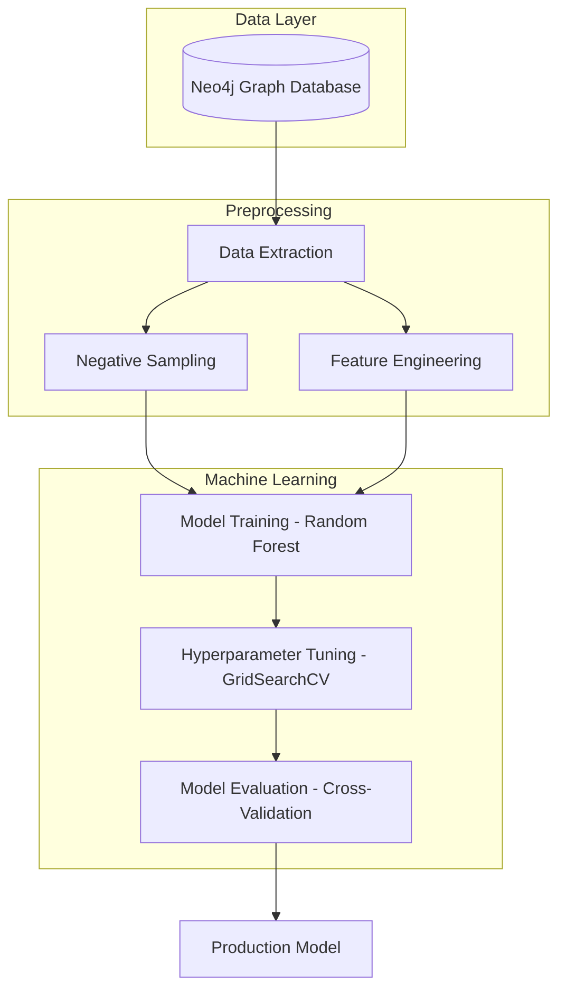

# 🔗 Neo4j Link Prediction Model

[](https://www.python.org/downloads/)
[](https://neo4j.com/)
[](https://scikit-learn.org/)
[](https://opensource.org/licenses/MIT)
[](https://github.com/AnkitSharma-29/Projects/graphs/commit-activity)

A production-ready machine learning pipeline for **Link Prediction** in graph databases. This project extracts topological features from a Neo4j graph and uses a Random Forest classifier to predict the likelihood of future or missing relationships (links) between nodes.

---

## 🚀 Key Features

- **Automated Data Extraction**: Direct integration with Neo4j via Cypher queries.
- **Topological Feature Engineering**: Computes structural similarity metrics including:
  - **Common Neighbors**: Absolute count of shared neighbors.
  - **Jaccard Similarity**: Normalized common neighbor score.
  - **Adamic-Adar Index**: Log-weighted structural importance.
  - **Node Degree Centrality**: Combined connectivity metrics.
- **Optimized ML Pipeline**:
  - Balanced sampling with automated negative edge generation.
  - Hyperparameter tuning using `GridSearchCV`.
  - Robust evaluation via 5-fold cross-validation.
- **Scalable Architecture**: Designed for integration into larger recommendation or fraud detection systems.

---

## 🏗️ System Architecture



---

## 🛠️ Tech Stack

- **Graph Engine**: [Neo4j](https://neo4j.com/) (Cypher Query Language)
- **Data Processing**: [Pandas](https://pandas.pydata.org/), [NumPy](https://numpy.org/)
- **Graph Analysis**: [NetworkX](https://networkx.org/)
- **Machine Learning**: [Scikit-Learn](https://scikit-learn.org/)
- **Connectivity**: [Neo4j Python Driver](https://neo4j.com/docs/python-manual/current/)

---

## 📦 Installation & Setup

### Prerequisites
- Python 3.8 or higher
- Access to a Neo4j instance (AuraDB or Local)

### 1. Clone the Repository
```bash
git clone https://github.com/AnkitSharma-29/Projects.git
cd "Link prediction model (Neo4j)"
```

### 2. Install Dependencies
```bash
pip install neo4j networkx pandas scikit-learn numpy
```

### 3. Configure Database
Update the connection details in `datascience_task.py`:
```python
uri = "neo4j+s://<your-instance-id>.databases.neo4j.io"
username = "neo4j"
password = "<your-password>"
```
> [!IMPORTANT]
> For production environments, it is highly recommended to use environment variables or secret management tools rather than hardcoding credentials.

---

## 📖 Usage

Run the main pipeline to extract features, train the model, and evaluate performance:

```bash
python datascience_task.py
```

### Making a Prediction
The model provides a `predict_link` function to check the likelihood of a relationship between two specific nodes:

```python
prediction = predict_link(source_node_id, target_node_id, best_model, neighbors, node_degrees)
print(f"Relationship Predicted: {'Yes' if prediction == 1 else 'No'}")
```

---

## 📊 Performance Metrics

The model is evaluated using standard classification metrics:
- **Accuracy**: Overall prediction correctness.
- **Cross-Validation Accuracy**: Ensures model stability across different data splits.

Typical results on the baseline dataset show high performance in distinguishing between structural neighbors and random pairs.

---

## 📜 License

Distributed under the MIT License. See `LICENSE` for more information.

---
Created with ❤️ by [Ankit Sharma](https://github.com/AnkitSharma-29)
