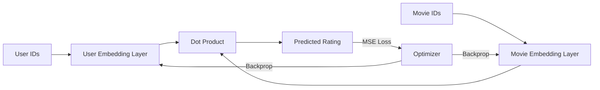

# 🎬 Cinematch: Neural Movie Recommendation Engine

[](https://www.python.org/)
[](https://pytorch.org/)
[](https://github.com/AnkitSharma-29/Projects)
[](https://opensource.org/licenses/MIT)

An advanced movie recommendation system leveraging **Collaborative Filtering** and **Latent Factor Modeling**. Cinematch decomposes high-dimensional, sparse user behavior into dense vector representations to predict preferences and discover hidden movie similarities.

---

## 🚀 Key Features

- **🔍 Neural Matrix Factorization**: Implemented with PyTorch for optimized gradient descent and high-dimensional latent space exploration.
- **⚡ GPU Acceleration**: Automatic CUDA detection for lightning-fast training on compatible hardware.
- **🧬 Semantic Clustering**: Integrated K-Means algorithm to group movies based on learned latent characteristics (discovering genres without metadata).
- **📊 Real-time Training Logs**: Interactive progress bars and loss tracking using `tqdm`.
- **📥 Automated Pipeline**: Hands-free dataset acquisition, extraction, and preprocessing.

---

## 🛠️ Tech Stack

- **Core Engine**: Python 3.12
- **Deep Learning**: PyTorch (Neural Embeddings)
- **Data Engineering**: Pandas, NumPy
- **Analysis**: Scikit-Learn (K-Means Clustering)
- **Visualization**: Matplotlib
- **Progress Tracking**: TQDM

---

## 📐 Architecture

The system utilizes a **Matrix Factorization** approach where users and items are embedded into a $K$-dimensional latent space.



---

## 🏁 Getting Started

### Prerequisites

Ensure you have Python 3.8+ installed. 

### Installation

1. **Clone the repository**:
   ```bash
   git clone https://github.com/AnkitSharma-29/Projects.git
   cd "Recommendation System"
   ```

2. **Install dependencies**:
   ```bash
   pip install torch pandas scikit-learn numpy tqdm matplotlib requests
   ```

### Running the Engine

Execute the core logic to download the dataset, train the model, and generate clusters:

```bash
python recommendation_logic.py
```

---

## 📊 Dataset: MovieLens

This project uses the **MovieLens Small Dataset** (latest-small).
- **Ratings**: 100,000+
- **Movies**: ~9,700
- **Users**: ~610
- **Source**: [GroupLens Research](https://grouplens.org/datasets/movielens/)

*Citation: F. Maxwell Harper and Joseph A. Konstan. 2015. The MovieLens Datasets: History and Context. ACM Transactions on Interactive Intelligent Systems (TiiS) 5, 4.*

---

## 📈 Performance & Results

After 128 training epochs, the model typically achieves a **Mean Squared Error (MSE) of <0.35**. 

### Cluster Insight Examples
Sample output of semantics discovered purely from rating behavior:
- **Cluster 1 (Sci-Fi/Action)**: *Inception, Interstellar, The Matrix, Star Wars.*
- **Cluster 2 (Drama/Classics)**: *The Godfather, Pulp Fiction, Schindler's List.*
- **Cluster 3 (Family/Comedy)**: *Toy Story, Aladdin, The Lion King.*

---

## 📁 Project Structure

```text
Recommendation System/
├── recommendation_logic.py  # Main engine (Training & Clustering)
├── README.md                # Documentation
├── Recommendation_System.ipynb # Research Notebook
└── test_torch.py            # Environment validation script
```

---

## 📄 License

This project is licensed under the MIT License - see the [LICENSE](LICENSE) file for details.

---

## 🤝 Contributing

Contributions are welcome! If you have ideas for improving the latent space mapping or adding hybrid filtering (content-based), feel free to open a Pull Request.
